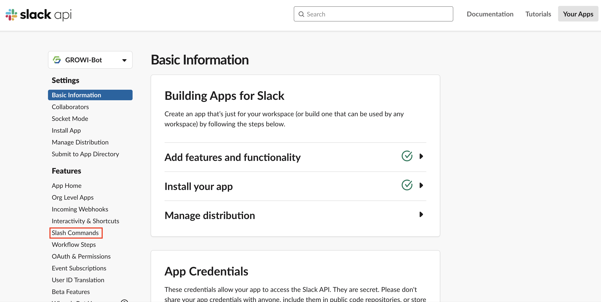
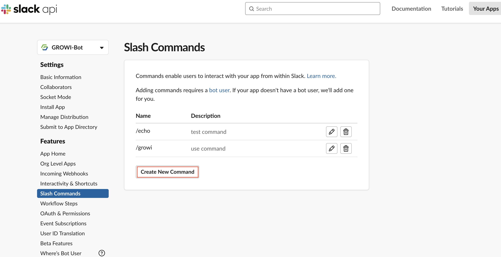

# Slack 連携

### GROWI Bot 作成方法

GROWI Bot を導入することで、Slack 上で「ページ検索」や「検索結果の共有」が可能になります。
Slack のワークスペースに GROWI Bot を導入するには、Slack アプリを新規作成する必要があります。  
手順は以下の通りです。

#### 1. Slack アプリの作成

- Slack API の[アプリページ](https://api.slack.com/apps)に移動し、「Create New App」をクリックします。

- 「Create a Slack App」の「App Name」にはアプリの名前を、「Development Slack Workspace」には GROWI bot を追加したいワークスペースを選択します。
- 「Creat App」をクリックします。

#### Slash コマンドの作成

- 作成した Slack App の **Features** から **Slash Commands** をクリックします。

- **Create New Command** をクリックします。

- Command に growi と入力してください。
- RequestURL には、ドメイン名/\_api/v3/slack-bot と入力してください。
- Short Description も入力必須なため、適当なご説明を入力してください。
- Usage Hint に関しては任意なので、適宜入力してください。
- Escape channels, users, and links sent to your app に関しては任意なので、適宜入力してください。
- 入力が完了したら、Save をクリックしてください。

